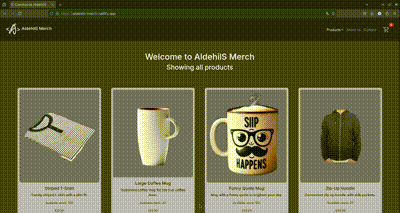

# eCommerce Project

This project is an eCommerce website built using React. The current progress includes a responsive Navbar, a CartWidget component, and an ItemListContainer component. Bootstrap is used for styling and responsiveness.



## Installation

Follow the steps below to set up and run the project locally:

1. **Clone the repository:**
    ```sh
    git clone https://github.com/AldehilS/react-course-coderhouse.git
    ```
2. **Navigate to the project directory:**
    ```sh
    cd <project-directory>
    ```
3. **Install the dependencies:**
    ```sh
    npm install
    ```
4. **Run the project:**
    ```sh
    npm run dev
    ```

## First milestone delivery
Here is a description of the components and main features made for the first delivery.

- **Navbar Component**:
  - Contains the brand name of the eCommerce site.
  - Includes three buttons for future sections (Products, About us, Contact).
  - Currently, these buttons do not navigate anywhere.

- **CartWidget Component**:
  - Renders a shopping cart icon.
  - Displays a badge with a hardcoded number to simulate the number of items in the cart.

- **ItemListContainer Component**:
  - Receives a prop with a welcome message and displays it.

- **Styling and Responsiveness**:
  - Utilized Bootstrap to style the components and ensure the page is responsive across different screen sizes.

## Second Milestone Delivery
### Implementations
- **React Router DOM**: Implemented `react-router-dom` to navigate between different pages of the application.
- **Product Fetch Simulation** : Simulated product fetching using fetch to retrieve data from a `products.js` file.
- **Product Display Logic**: Implemented logic to display products in `ItemListContainer` based on their category.
- **Product Detail View**: Created the `ItemDetailContainer` view to show product details by their ID.

## Final Delivery
### Implementations
- **Add to Cart and Purchase Flow**: Created the complete flow for adding products to the cart and proceeding with the purchase.
- **Component Refactoring**: Refactored `ItemListContainer` and `ItemDetailContainer` components to handle logic, while `ItemList` and `ItemDetail` handle presentation.
- **Firestore Integration**: Replaced local JSON fetches with Firestore queries from Firebase to retrieve products from the database, generate purchase orders, and update available product stock.
### Stock Management Flow
The flow used to check and update stock is as follows:

- **Stock Check**: Stock is checked when a user adds products to their cart.
- **Stock Update**: Stock is updated only when the purchase is completed, to avoid creating reserved stock that could be blocked if a user does not complete the purchase.

## Usage

Once the project is running, you can see the Navbar with the brand name and buttons for Products, About us, and Contact sections. The CartWidget icon with a badge and the welcome message from the ItemListContainer will also be displayed.

## License

This project is licensed under the Apache License, Version 2.0 - see the [LICENSE](LICENSE) and [NOTICE](NOTICE) files for details.

## Image Copyright

Please note that the image `src/assets/logo.png` is not covered by the Apache License, Version 2.0. The rights to this image are reserved by Aldehil de Jesús Sánchez Hernández. Unauthorized use of this image is prohibited without explicit permission.
